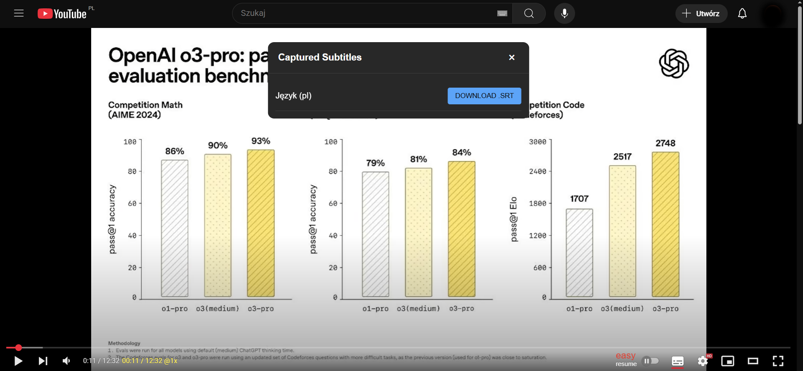
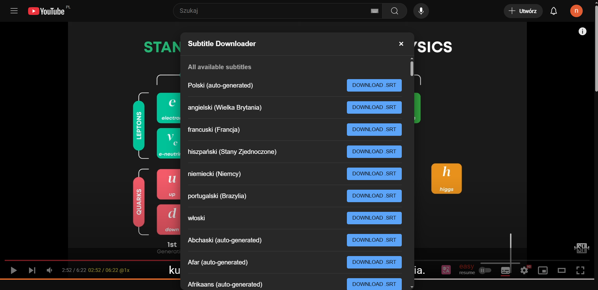
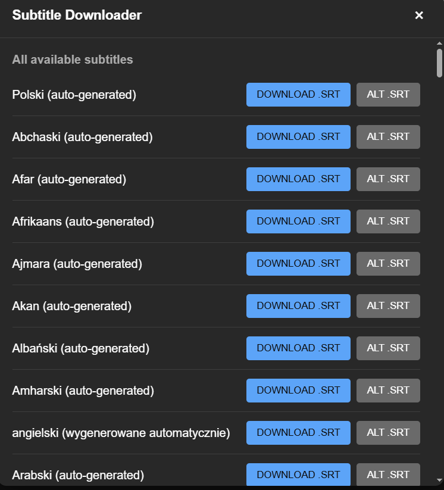

# Youtube Subtitle Downloader - Chrome extension

## 1. Load the movie, turn on subtitles, play, use the plugin to download subtitles.
## 2. If there are no subtitles in the extension window or they are not downloading (but are displayed in the movie), reload the page and try again.
## 3. If subtitles are prepared by the author of the film, they will appear without the note “auto-generated” (they are usually of better quality than those automatically translated by YouTube).
 
v2.0

Play movie on YT, turn on subtitles (YT icon default) (choose subtitles "by author" or "automate generated"), click on icon extension and download.
***
v3.0

### v4.0
An alternative download address has been added via the website (ALT.SRT button).
If the subtitles do not download after clicking, paste the movie address manually on the website.

# ATTENTION!
## Subtitles downloaded via ALT.SRT are often two lines long.
## This means that the player keeps one line and loads the next. Such subtitles are displayed incorrectly by standard PC players (MPC, PotPlayer, etc.).

Example:

1
00:00:00,570 --> 00:00:04,100
1 line

2
00:00:06,640 --> 00:00:12,240
2 line

3
00:00:09,920 --> 00:00:14,000
3 line

4
00:00:12,240 --> 00:00:15,920
4 line 

5
00:00:14,000 --> 00:00:18,640
5 line

***
#  1 line example:
1
00:00:00,570 --> 00:00:06,640
1 line

2
00:00:06,640 --> 00:00:09,920
2 line

3
00:00:09,920 --> 00:00:12,240
3 line

4
00:00:12,240 --> 00:00:14,000
4 line

5
00:00:14,000 --> 00:00:15,920
5 line
